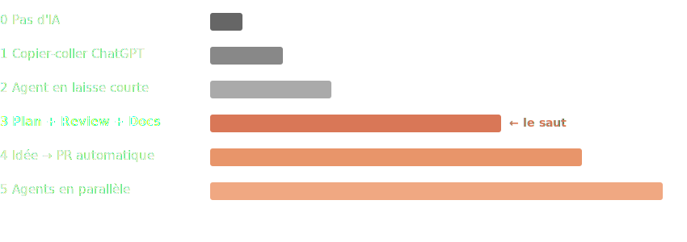

<p style="text-align:center"></p>

# <span style="color:#e8e6dc">❯</span> <span style="color:#d97757">Au-delà du Vibe Coding</span>

### Compound Engineering et le développement AI-native

---

## Lundi matin, 9h

Vous ouvrez votre terminal. Vous décrivez une feature à l'agent.
Dix minutes plus tard, le code est là. Ça compile. Les tests passent.

Vous mergez.

**Mardi, un bug en prod.** Vous rouvrez l'agent. Il ne se souvient de rien.
Vous ré-expliquez le contexte. Il propose un fix. Vous mergez.

**Mercredi, le même bug — ailleurs.** L'agent ne fait pas le lien.
Et vous non plus, parce que ce n'est plus votre code.

---

## Le problème n'est pas l'IA

> « Tu décris ce que tu veux, l'IA produit du code. Tu "vibes" avec le résultat. »
> — Andrej Karpathy, 2025

Scripts, POCs, side projects — c'est redoutablement efficace.

Mais en production, trois choses manquent :
- **Pas de mémoire** — chaque session repart de zéro
- **Pas de review** — le code passe, sans regard critique
- **Pas de capitalisation** — les erreurs ne servent qu'une fois

> Le Vibe Coding, c'est du prototypage qui s'ignore.

---

## L'industrie cherche la sortie

En 2026, deux approches émergent pour structurer le travail avec les agents :

<p style="text-align:center"></p>

Le **Spec-Driven Development** structure le briefing — specs, critères, edge cases.
Mais la spec est jetable. La session d'après, on recommence.

Le **Compound Engineering** fait la même chose, puis ajoute deux étapes :
**review systématique** et **capitalisation**.

---

## L'idée centrale

Et si chaque problème résolu rendait le suivant plus facile ?

<p style="text-align:center"></p>

La plupart des workflows s'arrêtent à la livraison.
Ici, après chaque cycle, on **extrait ce qu'on a appris** et on le réinjecte dans le projet.

L'agent de demain commence là où celui d'aujourd'hui a fini.

---

## Concrètement : la mémoire vit dans le repo

```
votre-projet/
├── CLAUDE.md        # Ce que l'agent doit savoir
├── docs/
│   ├── brainstorms/ # Idéation structurée
│   ├── solutions/   # Patterns extraits des bugs résolus
│   └── plans/       # Blueprints d'implémentation
└── todos/           # Tâches issues des reviews
```

Pas de base de données externe. Pas de SaaS. **Des fichiers markdown dans votre repo.**

L'agent les lit au démarrage. Vos collègues aussi.

---

## Le cycle en action

Reprenons le bug de mardi. Avec le CE, ça donne :

**1. Plan** — l'agent analyse le codebase, la doc framework, les best practices.
Il produit un blueprint *avant* d'écrire une ligne de code.

**2. Work** — il implémente depuis le plan, sur une branche isolée.

**3. Review** — des agents spécialisés (sécu, perfs, archi, simplification)
passent le code au peigne fin. Indépendamment. En parallèle.

**4. Compound** — le fix est analysé : quel pattern a causé le bug ?
La réponse est documentée dans `docs/solutions/`.

**Mercredi**, quand un bug similaire apparaît, l'agent *le sait déjà*.

---

## Ce qui change au quotidien

Avant : vous écrivez du code et parfois de la doc.
Après : **vous pilotez un système qui apprend.**

| Avant | Après |
|-------|-------|
| Décrire → Coder → Merger | Planifier → Exécuter → Reviewer → Capitaliser |
| L'agent est un outil | L'agent est un junior supervisé |
| La doc est une corvée | La doc est le carburant du système |
| Chaque session repart de zéro | Chaque session démarre avec le contexte |

> Le code n'est plus l'artefact principal. Le *système* l'est.

---

## Où en êtes-vous ?

<p style="text-align:center"></p>

Le passage de **2 à 3** est le moment clé.
Vous arrêtez de relire chaque ligne. Vous commencez à **diriger**.

---

## Soyons honnêtes

Le CE n'est pas magique. Voici ce que personne ne met dans les slides de démo :

- **Rien de révolutionnaire** — Will Larson : *« des pratiques connues, converties en quelque chose de concret et largement automatique »*. La nouveauté est dans la discipline, pas dans les idées
- **Le premier cycle est le plus lent** — il faut "enseigner" au système avant qu'il compose
- **Vos tests sont le plafond** — Will Larson : *« la qualité dépend plus de votre codebase et vos tests que de l'agent lui-même »*
- **Pas prouvé à grande échelle** — Every fait tourner 5 produits, 1 dev par produit. Quid d'une équipe de 20 ?

> C'est un multiplicateur — de vos forces *et* de vos faiblesses.

---

## Le piège que personne ne voit

Vibe Coding, SDD, CE — les trois externalisent le travail vers l'agent.
Plus l'outil est bon, plus le piège est confortable :
vous livrez plus vite, mais vous comprenez moins.

Les études (MIT, Microsoft, METR 2025) convergent :
**les développeurs qui délèguent sans superviser perdent progressivement leur capacité à résoudre seuls.**

> Micode en parle très bien : *« Comment ChatGPT détruit votre cerveau »*

---

## Garder la main

> « Il y a une façon d'utiliser l'IA pour nous rendre idiot, et une façon pour nous ouvrir l'esprit. »
> — r/ChatGPT_FR

Deux réflexes pour rester du bon côté :

- **Coder sans IA régulièrement** — katas, pet projects, debugging manuel. Le muscle qui ne travaille pas s'atrophie
- **Configurer votre `CLAUDE.md` en mode socratique** — l'agent donne des indices, pas des réponses. Vous restez aux commandes *même quand vous utilisez l'IA*

---

## Et si l'agent vous rendait *meilleur* ?

Le même outil peut atrophier ou muscler — ça dépend de comment on l'utilise.

**Le mode tuteur** (`/coding-tutor`) inverse la relation :
- L'agent analyse *votre* codebase et crée des exercices personnalisés
- Il enseigne par la méthode socratique — indices et pistes, pas de réponse directe
- Répétition espacée et quizz pour ancrer les concepts

Au lieu de déléguer ce que vous ne comprenez pas,
vous **apprenez** ce que vous ne comprenez pas.

> L'IA accélère. Votre compréhension décide de la direction.
> — Plugin CE : github.com/EveryInc/compound-engineering-plugin

---

## Pour essayer

```bash
# Compound Engineering
claude /plugin marketplace add EveryInc/compound-engineering-plugin
claude /plugin install compound-engineering
claude /ce:plan "Ajouter l'authentification OAuth2"

# AI Tutor — apprendre depuis votre code
claude /coding-tutor
```

---

# Demain matin,

# vous changez quoi ?

---

## Ressources

- **Guide définitif :** every.to/source-code/compound-engineering-the-definitive-guide
- **Guide pratique :** every.to/guides/compound-engineering
- **Analyse Larson :** lethain.com/everyinc-compound-engineering
- **Plugin :** github.com/EveryInc/compound-engineering-plugin
- **SDD :** martinfowler.com/articles/exploring-gen-ai/sdd-3-tools.html
- **Atrophie cognitive :** Micode — *Comment ChatGPT détruit votre cerveau* (YouTube)

**Merci.**
